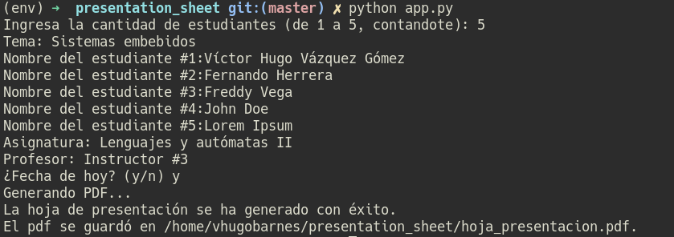

# Hoja de presentación

Con este pequeño script se evita la perdida de tiempo de estar creando una hoja de presentación. 
Esta diseñado específicamente para ser usado por estudiantes del instituto tecnológico de Matamoros :).

## NUEVO
Ahora puedes generar una hoja de presentación hasta para cinco personas

## Requisitos
- Tener instalado wkhtmltopdf

    - Ir a la [web oficial](https://wkhtmltopdf.org/downloads.html)
    
- Tener instalados los siguientes paquetes de Python y tener instalado Python 3.7

    - jinja2
    - pdfkit

## Ejemplo

- Cómo se ejecuta en consola (Para una persona):
         
     

- Cómo se ejecuta en consola (Para cinco personas):

    
        
- Cómo luce el pdf al generarse (Para una persona):
        
     

- Cómo luce el pdf al generarse (Para 5 personas):
        
     
     
## Instalación

Puedes ejecutar este script descargando la versión 3.+ en el apartado de releases de code [aquí en GitHub](https://github.com/VHugoBarnes/presentation_sheet/releases)

**Se recomienda usar la última release siempre**
