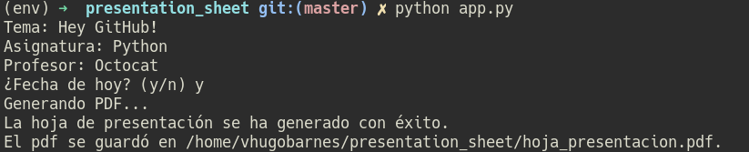

# Hoja de presentación

Con este pequeño script se evita la perdida de tiempo de estar creando una hoja de presentación. 
Esta diseñado específicamente para ser usado por estudiantes del instituto tecnológico de Matamoros :).

## Requisitos
- Tener instalado wkhtmltopdf

    - Ir a la [web oficial](https://wkhtmltopdf.org/downloads.html)
    
- Tener instalados los siguientes paquetes de Python y tener instalado Python 3.7

    - jinja2
    - pdfkit

## Ejemplo

- Cómo se ejecuta en consola:
         
     
        
- Cómo luce el pdf al generarse:
        
     
     
## Instalación

Puedes ejecutar este script descargando la versión 3.+ en el apartado de releases de code [aquí en GitHub](https://github.com/VHugoBarnes/presentation_sheet/releases)

**Se recomienda usar la última release siempre**
